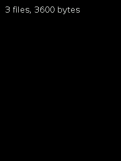

# The asset pack

[init](#qg_asset_init) · [find](#qg_asset_find) · [count and get](#qg_asset_count) · [pack size](#qg_asset_pack_size) · [verify](#qg_asset_verify) · [error text](#qg_asset_err_str) · [init at](#qg_asset_init_at)

Header: `qg_asset.h` · Library: `qg4p_assets` (separate from `qg4p`; link both).

An **asset pack** is a bundle of files (images, text, anything) built on your PC by `tools/mkpack.py` and loaded into the Pico's flash separately from your program. Your program then finds files by name. Changing the art means rebuilding the pack, not the program. Files are used where they sit in flash: nothing is copied into RAM.

Build and load a pack (see [tools](../05-tools.md#mkpackpy)):
```
python3 tools/mkpack.py my_assets --out build/assets
```
then hold BOOTSEL, plug in, and drag `build/assets.uf2` onto the drive (or `picotool load build/assets.bin -o 0x10100000`).

The examples here run with the examples' own pack (`examples/pack`) loaded.

A file in the pack, as `qg_asset_find` hands it over:

| Field | Meaning |
|---|---|
| `name` | its name, e.g. `"icons/star.bmp"` |
| `data`, `size` | its bytes, in flash |
| `type` | `QG_ASSET_TYPE_IMAGE`, `_TEXT`, `_SOUND` or `_OTHER` |
| `flags` | `QG_ASSET_FLAG_TRANSPARENT`: an image to open with `QG_IMAGE_TRANSPARENT` |

---

## qg_asset_init

Finds and checks the pack in flash. Call it once, at start-up.

```c
qg_asset_err_t qg_asset_init(void);
```

```c example=asset_init pack
if (qg_asset_init() != QG_ASSET_OK) {
    qg_print_at(&scr, 10, 10, "No asset pack", QG_LIGHTRED, NULL);
} else {
    qg_print_at(&scr, 10, 10, "Asset pack ready", QG_LIGHTGREEN, NULL);
}
```


| Returns | |
|---|---|
| `QG_ASSET_OK` | ready |
| `QG_ASSET_ERR_NO_PACK` | no pack in flash (never loaded, or erased) |
| `QG_ASSET_ERR_VERSION` | a pack from a newer `mkpack.py` |
| `QG_ASSET_ERR_CORRUPT` | a damaged pack |
| `QG_ASSET_ERR_OVERLAP` | your program has grown into the pack's space (flash from 1 MB on); see `QG_ASSET_PACK_OFFSET` |

**Notes:** quick: it checks the pack's header and every file entry, but not every byte (that's [`qg_asset_verify`](#qg_asset_verify)). A missing pack isn't a crash: show a message, as the [asset pack example](../03-examples.md#7-asset-pack) does.

---

## qg_asset_find

Finds a file by name.

```c
qg_asset_err_t qg_asset_find(const char *name, qg_asset_t *out);
```

```c example=asset_find pack
qg_asset_init();
qg_asset_t a;
if (qg_asset_find("art/scene.bmp", &a) == QG_ASSET_OK) {
    qg_image_t img;
    qg_image_open(&img, a.data, a.size,
                  (a.flags & QG_ASSET_FLAG_TRANSPARENT) ? QG_IMAGE_TRANSPARENT : 0);
    qg_image_draw(&scr, &img, 0, 80);
}
```


| Returns | |
|---|---|
| `QG_ASSET_OK` | found; `out` describes it |
| `QG_ASSET_ERR_NOT_FOUND` | no such file |
| `QG_ASSET_ERR_NOT_READY` | [`qg_asset_init`](#qg_asset_init) hasn't succeeded |

**Notes:** names are as in the folder you packed, with `/` between folders; images converted from PNG, JPG or GIF end in `.bmp`. A lookup takes about a microsecond. Text files aren't followed by a `'\0'`, so copy one into a buffer (adding the `'\0'`) before printing it.

---

## qg_asset_count

How many files are in the pack, and the file at each position (in name order): for listings.

```c
uint16_t qg_asset_count(void);
qg_asset_err_t qg_asset_get(uint16_t i, qg_asset_t *out);
```

```c example=asset_count pack
qg_asset_init();
qg_locate(&scr, 6, 6);
for (uint16_t i = 0; i < qg_asset_count(); i++) {
    qg_asset_t a;
    qg_asset_get(i, &a);
    qg_println(&scr, a.name);
}
```


---

## qg_asset_pack_size

The pack's total size in bytes (0 without one).

```c
uint32_t qg_asset_pack_size(void);
```

```c example=asset_pack_size pack
char text[40];
qg_asset_init();
snprintf(text, sizeof text, "%u files, %lu bytes", qg_asset_count(),
         (unsigned long)qg_asset_pack_size());
qg_print_at(&scr, 10, 10, text, QG_WHITE, NULL);
```


---

## qg_asset_verify

Checks every byte of the pack against its checksum, to catch a damaged or half-written pack.

```c
qg_asset_err_t qg_asset_verify(void);
```

```c example=asset_verify pack
qg_asset_init();
qg_asset_err_t e = qg_asset_verify();
qg_print_at(&scr, 10, 10, e == QG_ASSET_OK ? "Pack checks out" : qg_asset_err_str(e),
            QG_WHITE, NULL);
```


**Notes:** reads the whole pack, about 0.2 seconds per MB, so call it once at start-up if you want it. It's also the only function that needs the 1 KB checksum table; programs that don't call it don't carry it.

---

## qg_asset_err_str

A short description of an error, for messages.

```c
const char *qg_asset_err_str(qg_asset_err_t err);
```

```c example=asset_err_str pack
qg_asset_init();
qg_asset_t a;
qg_asset_err_t e = qg_asset_find("icons/unicorn.bmp", &a);
qg_print_at(&scr, 10, 10, qg_asset_err_str(e), QG_LIGHTRED, NULL);
```


---

## qg_asset_init_at

[`qg_asset_init`](#qg_asset_init) for a pack at any address: in RAM, or elsewhere in flash.

```c
qg_asset_err_t qg_asset_init_at(const uint8_t *pack);
```

```c example=asset_init_at compile-only
extern const uint8_t my_second_pack[];            /* e.g. a pack compiled in as an array */
qg_asset_init_at(my_second_pack);
```

**Notes:** the normal place is set by `QG_ASSET_PACK_OFFSET` (1 MB into flash); `qg_asset_init()` looks there.
